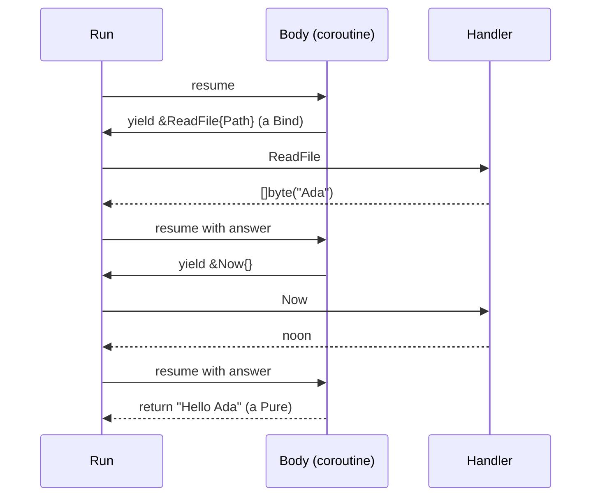

# Effects: programs as data, with mkunion

This document shows how to build a small effect system in Go with `mkunion`, using the example of a Welcome Mail service.
You will learn:

- how to model the **operations** a program may perform as a union, and write programs as plain Go against them
- how the same program runs against the **real world** in production and against a **fake** in tests
- how to **record a run as a tape**, replay it without any I/O, and store it as JSON
- how to handle **failure** the way an experienced engineer does: retry policies per operation, idempotency keys, crash and resume, seeded chaos
- how to keep a **business refusal** ("out of budget") apart from an **infrastructure failure** ("connection reset"), so retry only ever sees the second
- how a typed **trace** can be diffed, guarded by a policy, and turned into spans

Side note: if you want to go straight to the final code, then go into the [example/effect/](https://github.com/widmogrod/mkunion/tree/main/example/effect) directory. `doc.go` lists the files in reading order, and every part has a test file that shows the behaviour with real data.

## Working example

The Welcome Mail service does one small job: read a customer's name from a file, mail them a greeting with the current time, and log the receipt.

Four things can happen in that job. We will call them **operations**:

- `ReadFile` - read the content of a file
- `Now` - ask for the current time
- `Send` - deliver a message. This one is dangerous: send it twice and the customer gets two mails
- `Log` - write a line somewhere

(There is a fifth, `Random`, which we use to show loops.)

The trick that this whole document builds on is simple. A program **asks** for these operations. It never performs them. Something else, called a **handler**, performs them. In production the handler talks to the file system and the mail server. In a test it answers from a map. In a replay it answers from a tape.

We start with a program that only greets, `Greet`, and add the mail in Part 3.

## Part 1: the basics

### Operations are a union

Each operation is a struct in a `type (...)` block tagged with `mkunion`, exactly like a state or a command in the [state machine](./state_machine.md) example.

```go title="example/effect/ops.go"
--8<-- "example/effect/ops.go:ops-def"
```

**Notice** the embedded `f.Returns[...]` in every operation. It is a phantom: no fields, no methods, nothing at runtime. It is a label for the compiler and for `mkunion`. It says what type of answer an operation gets back: a `ReadFile` answers with `[]byte`, a `Send` answers with a receipt `string`, a `Log` answers with `Unit`, the empty struct, because there is nothing to return. Later you can write `fx.Do(&Now{})` and get a `time.Time` without spelling it out.

**Notice** also the `handler` option in the tag. It tells `mkunion` to read those labels and generate the typed layer for the union. The next section shows what comes out.

### Programs are plain Go

A program is a function that gets a handle, `Fx`, and calls methods on it. It reads like any Go code:

```go title="example/effect/program.go"
--8<-- "example/effect/program.go:greet"
```

There is one thing to keep in mind. Calling `Greet("name.txt")` performs nothing. It returns a `Program[string]`, a value. The body runs later, when you hand the value to `Run` together with a handler. Part 2 explains how that works. For now, the surface:

```go title="example/effect/program.go"
--8<-- "example/effect/program.go:fx-api"
```

**Notice** that `Fx` has one method per operation, plus a generic `Do` and `Attempt`. `Do` stops the body when an operation fails, and the program fails with that error. `Attempt` hands the error to the body instead, for the cases where the body knows what to do:

```go title="example/effect/program.go"
--8<-- "example/effect/program.go:greet-or-guest"
```

Loops are loops. A program that performs a million operations is a million steps in `Run`, not a million stack frames:

```go title="example/effect/program.go"
--8<-- "example/effect/program.go:roll"
```

### Handlers give the program meaning

At the bottom, a handler is one function: it gets an operation and returns the answer.

```go title="example/effect/eff.go"
--8<-- "example/effect/eff.go:handler"
```

You will rarely write that function by hand. The `handler` option makes `mkunion` generate a typed contract from the union and its `f.Returns` labels. This is the part of `example/effect/ops_union_gen.go` that matters:

```go title="example/effect/ops_union_gen.go (generated)"
// EffectHandler answers every Effect with the type it declares in f.Returns.
// Adding a variant to Effect breaks every EffectHandler at compile time.
type EffectHandler interface {
	HandleLog(ctx context.Context, op *Log) (Unit, error)
	HandleNow(ctx context.Context, op *Now) (time.Time, error)
	HandleReadFile(ctx context.Context, op *ReadFile) ([]byte, error)
	HandleRandom(ctx context.Context, op *Random) (int, error)
	HandleSend(ctx context.Context, op *Send) (string, error)
	HandleCharge(ctx context.Context, op *Charge) (f.Result[Receipt, ChargeError], error)
}

// EffectOf is an Effect that answers with R.
type EffectOf[R any] interface {
	Effect
	HandleEffect(ctx context.Context, h EffectHandler) (R, error)
}

// *Now is an EffectOf[time.Time], and nothing else.
func (r *Now) HandleEffect(ctx context.Context, h EffectHandler) (time.Time, error) {
	return h.HandleNow(ctx, r)
}

// EffectHandlerFunc adapts a typed EffectHandler to a plain function over the union.
func EffectHandlerFunc(h EffectHandler) func(ctx context.Context, op Effect) (any, error)

// EffectDefaults answers every Effect with the zero value of its declared type.
type EffectDefaults struct{}
```

Four things, all from one declaration:

- `EffectHandler` is the contract: one method per operation, typed by its `f.Returns`. Adding an operation breaks every handler until it handles the new case. When `Charge` was added to this example, the compiler pointed at every handler, policy and decoder that needed a decision.
- `EffectOf[R]` ties an operation to its answer. `*Now` satisfies `EffectOf[time.Time]` and nothing else, so `fx.Do(&Now{})` can only be a `time.Time`. Go interfaces cannot carry generic methods, so this is how a per-variant answer type is spelled in Go: on the interface's type parameter, and in the handler's method signatures.
- `EffectHandlerFunc` is the adapter to the function `Run` uses.
- `EffectDefaults` is a handler that answers everything with a zero value, for tests.

The one piece still written by hand is `Perform`, the bridge from an operation to a program. It is two lines:

```go title="example/effect/ops.go"
--8<-- "example/effect/ops.go:typed-layer"
```

For production there is `Live`:

```go title="example/effect/handlers.go"
--8<-- "example/effect/handlers.go:live"
```

(`HandleSend` passes a `key` along. Ignore it until Part 4, where it becomes the idempotency key.)

For tests there is `Fake`, which answers from fixed data and remembers what was logged and sent:

```go title="example/effect/handlers.go"
--8<-- "example/effect/handlers.go:fake"
```

### Run it

`Run` takes a context, a handler and a program. The first test does exactly that, and also wraps the handler in `Trace`, which records every operation in order:

```go title="example/effect/part1_basics_test.go"
--8<-- "example/effect/part1_basics_test.go:run-fake"
```

Swap `EffectHandlerFunc(fake)` for `EffectHandlerFunc(live)` and the same program writes a real log line. The tests in `example/effect/part1_basics_test.go` do both, and also show that a handler error stops the program at that step, and that a cancelled context stops it before the next one.

### Testing on day one

Two habits pay off from the first test.

First, assert on the **trace**, as the test above does. An output test says what came out. A trace test says what the program did to get there. `Trace` is ten lines:

```go title="example/effect/eff.go"
--8<-- "example/effect/eff.go:trace"
```

Second, override one method at a time. `Defaults` is a handler with harmless answers. It embeds the generated `EffectDefaults` and changes two answers. Embed it and override only what the test cares about. The compiler still checks that the result is a complete handler:

```go title="example/effect/handlers.go"
--8<-- "example/effect/handlers.go:defaults"
```

```go title="example/effect/part1_basics_test.go"
--8<-- "example/effect/part1_basics_test.go:clock-only"
```

**Notice** that `Defaults` refuses to read files. A test cannot depend on a file by accident.

## Part 2: under the hood

You can use everything in Part 1 without reading this part. Read it when you want to know why this is not just dependency injection.

### A program is a union too

`Program[A]` is a short name for `Eff[Effect, A]`, and `Eff` is a generic union:

```go title="example/effect/eff.go"
--8<-- "example/effect/eff.go:eff-def"
```

A program is either finished (`Pure` with a value, `Fail` with an error), or it asks for one operation and says what to do with the answer (`Bind`), or it is built on demand (`Suspend`). That is the whole data model.

`Then` glues two programs together. It is a pattern match over the variants, so a new variant cannot be forgotten:

```go title="example/effect/eff.go"
--8<-- "example/effect/eff.go:then"
```

With `Perform` and `Then` you can build a program by hand. This is what `Fx` builds for you:

```go title="example/effect/part2_under_the_hood_test.go"
--8<-- "example/effect/part2_under_the_hood_test.go:greet-then"
```

The tests run the trace and the error scenarios against both versions of `Greet` and assert the same data. Two ways to write it, one result.

| Style | Write it when | Trade |
|---|---|---|
| `Prog` + `Fx` (default) | Always, for business logic. It reads like Go. | Needs a coroutine per run. |
| `Perform` + `Then` | When you build programs from data, or write combinators such as `Map`. | Nests one level per step. |

### Run is a loop

```go title="example/effect/eff.go"
--8<-- "example/effect/eff.go:run"
```

**Notice** that `Run` never recurses. It takes the next node, asks the handler, and moves on. That is why a million-step program does not grow the stack. Also notice what happens on error: the error goes to the continuation, the same as an answer. That is how a plain Go body gets to unwind, and how `Attempt` gets to see the error.

### Proc is a coroutine

The last piece. How does a plain Go body become `Bind` nodes, one at a time? With `iter.Pull`, which Go has had since 1.23. It turns a function into a coroutine that can pause and resume.



```go title="example/effect/proc.go"
--8<-- "example/effect/proc.go:proc"
```

Every `DoAs` (which `Fx.Do` calls) pauses the body and hands the operation out as a `Bind`. `Run` asks the handler, and the answer resumes the body. An error makes `DoAs` panic with a private `abort` value that the coroutine recovers, so the body unwinds and the coroutine is released. The body does not start before `Run`, because `Proc` returns a `Suspend`; Part 1 has a test for that. Part 2's tests check that a panic in the body is not swallowed and that no coroutine leaks when a handler fails or the context is cancelled.

## Part 3: testing with tapes

Now the mail. `Notify` is `Greet` plus a `Send`, and `Send` must never happen twice. Every test from here on uses it.

```go title="example/effect/program.go"
--8<-- "example/effect/program.go:notify"
```

### Record once, replay forever

Because every operation and every answer is data, a run can be written down. `Record` writes the tape. `Replay` answers from it and checks that the program still asks for the same things:

```go title="example/effect/recording.go"
--8<-- "example/effect/recording.go:recording"
```

```go title="example/effect/part3_testing_test.go"
--8<-- "example/effect/part3_testing_test.go:record-replay"
```

A tape is a golden test that you did not have to write, and it guards against drift: a program that asks for a different file fails with "replay mismatch at step 1".

### A tape is JSON

The `Effect` union has JSON, generated by `mkunion`, so a tape has JSON too. Answers are decoded into the type each operation declared:

```go title="example/effect/recording_json.go"
--8<-- "example/effect/recording_json.go:tape-json"
```

The test in `example/effect/part3_testing_test.go` shows the exact JSON and replays from it alone. The same union exports to TypeScript, so a browser can read or build a tape. This is the output of `mkunion shape-export --language typescript -i example/effect/ops.go`, trimmed to the union:

```typescript
export type Effect = {
    "$type"?: "effect.Log",
    "effect.Log": Log
} | {
    "$type"?: "effect.Now",
    "effect.Now": Now
} | {
    "$type"?: "effect.ReadFile",
    "effect.ReadFile": ReadFile
} | {
    "$type"?: "effect.Random",
    "effect.Random": Random
} | {
    "$type"?: "effect.Send",
    "effect.Send": Send
}
```

## Part 4: failure is normal

Handlers are functions. So middleware is a function that takes a handler and returns a handler. It wraps the handler once and sees every operation of every program. Every tool in this part is such a function.

### Retry is a policy per operation, not one number

Reading a file may be retried. Sending a mail may not, unless you can prove it is safe. `RetryWith` asks a policy for each operation. A `RetryBudget` caps retries across the whole run, and sleep is injected so tests can assert the backoff durations instead of waiting for them.

```go title="example/effect/middleware.go"
--8<-- "example/effect/middleware.go:retry"
```

The policy is an exhaustive match, so the compiler asks "may this be retried?" for every new operation:

```go title="example/effect/part4_failures_test.go"
--8<-- "example/effect/part4_failures_test.go:strict-policy"
```

**Notice** that middleware order is semantics. `Record(Retry(h))` writes one committed answer per step. `Retry(Record(h))` writes every attempt, failures included. Only the first tape replays to success; the second replays the failure. The test shows both tapes side by side.

### A refusal is an answer, not a failure

"Out of budget" and "connection reset" are not the same kind of thing, and one `error` channel mixes them up. A bank that refuses a charge did its job. A line to the bank that dropped did not. Retry must see the second and never the first.

The answer type keeps them apart. `Charge` answers with a `Result`: a `Receipt`, or a `ChargeError` that says why:

```go title="example/effect/ops.go"
--8<-- "example/effect/ops.go:charge-error"
```

The program matches on the answer. Exhaustively, so a new refusal is a compile error in every program that charges:

```go title="example/effect/program.go"
--8<-- "example/effect/program.go:pay"
```

A refusal is a value, so no retry policy can ever retry it. A broken line is a Go error, so the policy gets its say. A refusal on a tape keeps its variant, because a union answer is written with the JSON `mkunion` generates for it:

```go title="example/effect/part4_failures_test.go"
--8<-- "example/effect/part4_failures_test.go:refusal"
```

The rule that falls out: **a business outcome is a value in the answer type, an infrastructure failure is a Go error.** Everything in this part follows that rule.

### Fault tools

The tests need faults that happen on purpose. Each one is a small wrapper:

```go title="example/effect/middleware.go"
--8<-- "example/effect/middleware.go:faults"
```

`FailEvery` refuses before performing. `LoseAnswerAt` is the nasty one: it performs, then reports an error anyway. `CrashAfter` is a process that dies. `Chaos` rolls dice from a seed.

### At-least-once, and idempotency keys

The nasty fault is not "the call failed". It is "the mail server delivered, then the answer was lost". A retry sends the mail again. `LoseAnswerAt` injects exactly that fault, and the test shows two identical mails in the mailbox.

The fix comes from the run itself. `StepKeys` gives every step a stable key, `run-1/3`. The handler passes it to the mail server as an idempotency key. All retries of one step share the key. On resume, replayed steps still count, so step 3 keeps its key.

```go title="example/effect/middleware.go"
--8<-- "example/effect/middleware.go:step-keys"
```

```go title="example/effect/handlers.go"
--8<-- "example/effect/handlers.go:mailbox"
```

With keys the mailbox holds one mail, and the retry receives the receipt of the first delivery. This is how durable workflow engines make activities safe.

### Crash at every step, then resume

`Replay(tape, live)` answers the recorded steps from the tape and hands everything after them to the live handler. That is resume after a crash. And because the tape is finite, the crash points can be searched completely: crash after step 0, 1, 2 and 3 (step 4 is the clean run), resume each time, and assert the same receipt and exactly one mail.

```go title="example/effect/part4_failures_test.go"
--8<-- "example/effect/part4_failures_test.go:crash-resume"
```

**Notice** the choice the test points out: `Log` has no key, so it is at-least-once. Whether that is fine is a decision per operation, and the union makes you take it.

### Seeded chaos

`Chaos` injects refusals and lost answers at random from a seed. The test runs five hundred worlds and logs the counts. Without keys, chaos finds double delivery in dozens of seeds. With keys, every world is exactly-once or a clean failure, and a failing world replays from its seed alone. That is deterministic simulation testing in a unit test.

## Part 5: seeing what happened

A trace of typed operations can do three things log lines and spans cannot.

### Diff two runs

The test has a "version two" of `Notify` that adds a config read and moves the clock read. The output is identical, so an output test passes. `DiffTraces` shows the change:

```
+ *effect.ReadFile{"Path":"config.txt"}
+ *effect.Now{}
  *effect.ReadFile{"Path":"name.txt"}
- *effect.Now{}
  *effect.Send{"To":"ada@example.com","Msg":"Hello Ada, it is 12:00PM"}
  *effect.Log{"Msg":"sent receipt-1"}
```

(Each line is the operation's type and the JSON `mkunion` generates for it.)

### Enforce a policy

`Guard` refuses operations before they run. Authorization and dry-run are the same function: an exhaustive match, so a new operation has to be classified.

```go title="example/effect/observe.go"
--8<-- "example/effect/observe.go:guard"
```

### Feed your tracing backend

`Spans` emits one span per operation, with start, end, attributes and error, from one place. With dependency injection you would instrument each client.

```go title="example/effect/observe.go"
--8<-- "example/effect/observe.go:spans"
```

## When to use this, and when not

The `Fx` surface looks like interfaces and structs, because it is. The difference is under the surface. With dependency injection, `fx.ReadFile(path)` runs a method and the call is gone. With effects, it builds a value and that value passes through one door, `Run`, in order, as data. Everything in Parts 3 to 5 follows from that one door.

When a program is "call three services and return" and you only need swap-for-tests, plain dependency injection is enough, and cheaper. Effects earn their cost when you need the tape, the resume, the same middleware on every call, or a trace you can diff: workflow engines, sagas, simulation testing, audit logs, dry-run modes. If you never need those, delete Parts 2 to 5 and keep the interfaces. Nothing in Part 1 has to change.

## Conclusion

A union of operations, a handler per environment, and one `Run` loop are enough to turn ordinary Go into programs you can trace, replay, resume and audit. The compiler keeps every handler, policy and decoder honest when the union grows. Start with Part 1 and add the rest when a real problem asks for it.

??? note "Notes for contributors"

    A few things learned while building this, for whoever extends it.

    - **Go 1.27 generic methods** make `fx.Do(&Now{})` possible: a method with its own type parameter, with `R` inferred from the operation. Interfaces still cannot carry generic methods, so the union interface `Eff` cannot have a `Then` method, and the `Bind` chain stays `any` inside, with `EffectOf[R]` keeping it typed at the edges.
    - **The typed layer is generated.** `EffectHandler`, `EffectOf`, the typed dispatch, `EffectHandlerFunc` and `EffectDefaults` come from the `handler` union option and the `f.Returns` labels (see `x/generators/handler_generator.go`). Still by hand: `Perform`, the `Fx` convenience methods, and the two exhaustive matches in `recording_json.go` that pick the JSON codec per answer. The last one could be generated too, once serde knows about `f.Returns`.
    - **Extensible effects are not expressible.** Go cannot say "this program uses `Log` and `Now` but not `Send`" as a type built on the fly. Two workable models: small unions wrapped into one app union with a lift function, or capability interfaces on `Fx` (`interface{ Clock; FS }`) with one app union underneath. Neither is in this example yet.
    - **Generator bugs found on the way.** The type registry generator produced code that does not compile for this package, so the registry is off with `//go:tag mkunion:",no-type-registry"`. It mistook the type parameter `Op` in `Trace[Op any](..., sink *[]Op)` for a package type, and it ignored `noserde` on `Eff`.

## Next steps

- **[State Machines](./state_machine.md)** - the other way this repository turns behaviour into data
- **[Generic Unions](./generic_union.md)** - the mechanics `Eff[Op, A]` builds on
- **[Custom Pattern Matching](./custom_pattern_matching.md)** - the other tag-driven generator in this repository
