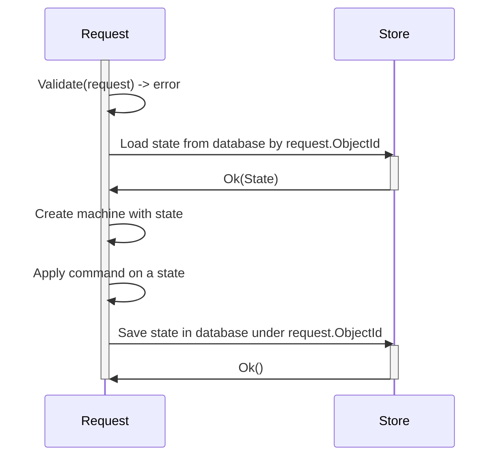

# MkUnion and state machines in golang

This document will show how to use `mkunion` to manage application state on example of an order service. 
You will learn:

- how to model state machines in golang, and find similarities to "__clean architecture__"
- How to **test state machines** (with fuzzing), and as a bonus you will get mermaid diagrams for free
- How to **persist state in database** and how optimistic concurrency helps __resolve concurrency conflicts__
- How to **handle errors** in state machines, and build foundations for __self-healing__ systems


## Working example

As an driving example, we will use an order service that can be in one of the following states:

- `Pending` - order is created, and is waiting for someone to process it
- `Processing` - order is being processed, an human is going to pick up items from warehouse and pack them
- `Cancelled` - order was cancelled, there can be many reason, one of them is that warehouse is out of stock.
- `Completed` - order is completed, and can be shipped to customer.

Such states, have rules that govern **transitions**, like order cannot be cancelled if it's already completed, and so on.

And we need to have also to trigger changes in state, like create order that pending for processing, or cancel order. We will call those triggers **commands**.

Some of those rules could change in future, and we want to be able to change them without rewriting whole application.
This also informs us that our design should be open for extensions.

Site note, if you want go strait to final code product, then into [example/state/](example/state/) directory and have fun exploring.

## Modeling commands and states

Our example can be represented as state machine that looks like this:
[simple_machine_test.go.state_diagram.mmd](example/state/simple_machine_test.go.state_diagram.mmd)
```mermaid
--8<-- "example/state/machine_test.go.state_diagram.mmd"
```

In this diagram, we can see that we have 4 states, and 4 commands that can trigger transitions between states shown as arrows.

Because this diagram is generated from code, it has names that represent types in golang that we use. 

For example `*state.CreateOrderCMD`:

- `state` it's a package name
- `CreateOrderCMD` is a struct name in that package.
- `CMD` suffix it's naming convention, that it's optional, but I find it to make code more readable.


Below is a code snippet that demonstrate complete model of **state** and **commands** of order service, that we talked about.

**Notice** that we use `mkunion` to group commands and states. (Look for `//go:tag mkunion:"Command"`)

This is one example how union types can be used in golang. 
Historically in golang it would be very hard to achieve such thing, and it would require a lot of boilerplate code.
Here interface that group those types is generated automatically.

```go
--8<-- "example/state/model.go"
```

## Modeling transitions
One thing that is missing is implementation of transitions between states. 
There are few ways to do it, today I will show you how to do it using functional approach.

You can think about this function like a `reduce` or `map` function, that you may be familiar.


Let's name this function `Transition` that has following signature (name is arbitrary, you can name it as you like):
Our function takes current state and command, and returns new state, and as you can see it.

```go
func Transition(dep Dependencies, cmd Command, state State) (State, error)
```

Let's break down this signature.

Input arguments are:

- `dep` encapsulates dependencies like API clients, database connection, configuration, context etc.
   everything that is needed for complete production implementation.
- `cmd` it's a command that we want to apply to state, 
   and it has `Command` interface, that was generate by `mkunion` when it was used to group commands.
- `state` it's a state that we want to apply our command to and change it, 
   and it has `State` interface, that was generate similarly to `Command` interface.


Output value is either new state, or error if something went wrong. This is very important assumption, 
that will come very handy when we will talk about self-healing processes.

Below is snippet of implementation of `Transition` function for our order service:

```go
--8<-- "example/state/machine.go:30:81"
// ...
// rest remove for brevity 
// ...
```

You can notice few patterns in this snippet:

- `Dependency` interface help us to keep, well  dependencies - well defined, which helps greatly in testability and readability of the code. 
- Use of generated function `MatchCommandR2` to exhaustively match all commands. 
  This is powerful, when new command is added, you can be sure that you will get compile time error, if you don't handle it.
- Validation of commands in done in transition function. Current implementation is simple, but you can use go-validate or other libraries to make it more robust.
- Each command check state to which is being applied using `switch` statement, it ignore states that it does not care about. 
  Which means as implementation you have to focus only on small bit of the picture, and not worry about rest of the states. 
  This is also example where non-exhaustive use of `switch` statement is welcome.

Simple, isn't it? Simplicity also comes from fact that we don't have to worry about marshalling/unmarshalling data, working with database, those are things that will be done in other parts of the application, keeping this part clean and focused on business logic.

Note: Implementation for educational purposes is kept in one big function, 
but for large projects it may be better to split it into smaller functions, 
or use visitor pattern interface, that is also generated for you.


## Testing state machines & self-documenting
Before we go further, let's talk about testing our implementation.

Testing will help us not only ensure that our implementation is correct, but also will help us to document our state machine, 
and discover transition that we didn't think about, that should or shouldn't be possible.

Here is how you can test state machine, in declarative way, using `mkunion/x/machine` package:

```go
--8<-- "example/state/machine_test.go:12:86"
```
Few things to notice in this test:

- We use of `moq` to generate mocks for dependencies
- We use standard go testing
- We use `machine.NewTestSuite` as an standard way to test state machines
- We start with describing **happy path**, and use `suite.Case` to define test case.
- But most importantly, we define test cases using `GivenCommand` and `ThenState` functions, that help in making test more readable.
- You can see use of `ForkCase` command, that allow you to take a definition of a state declared in `ThenState` command, and apply new command to it, and expect new state.

I know it's subjective, but I find it very readable, and easy to understand, even for non-programmers.

## Generating state diagram from tests
Last bit is this line at the bottom:

```go
if suite.AssertSelfDocumentStateDiagram(t, "machine_test.go") {
   suite.SelfDocumentStateDiagram(t, "machine_test.go")
}
```

This code takes all inputs provided in test suit and fuzzy them, apply commands to random states, and records result of those transitions.

 - `SelfDocumentStateDiagram` - produce two `mermaid` diagrams, that show all possible transitions that are possible in our state machine.
 - `AssertSelfDocumentStateDiagram` can be used to compare new generated diagrams to diagrams committed in repository, and fail test if they are different.
   You don't have to use it, but it's good practice to ensure that your state machine is well tested and don't regress without you noticing.


There are two diagrams that are generated.

One is a diagram of ONLY successful transitions, that you saw at the beginning of this post.

```mermaid
--8<-- "example/state/machine_test.go.state_diagram.mmd"
```

Second is a diagram that includes commands that resulted in an errors:
```mermaid
--8<-- "example/state/machine_test.go.state_diagram_with_errors.mmd"
```

Those diagrams are stored in the same directory as test file, and are prefixed with name used in `AssertSelfDocumentStateDiagram` function.
```
machine_test.go
machine_test.go.state_diagram.mmd
machine_test.go.state_diagram_with_errors.mmd
```


## Persisting state in database



Example implementation of such sequence diagram:

```go
func Handle(rq Request, response Resopnse) {
	ctx := rq.Context()
	
	// extract objectId and command from request + do some validation
    id := rq.ObjectId
	command := rq.Command
	
    // Load state from store
    state, err := store.Find(ctx, id)
	if err != nil { /*handle error*/ }

    machine := NewSimpleMachineWithState(Transition, state)
    newState, err := machine.Apply(cmd, state)
    if err != nil { /*handle error*/ }
	
    err := store.Save(ctx, newState)
    if err != nil { /*handle error*/ }
	
	// serialize response
	response.Write(newState)
}
```

## Error as state. Self-healing systems.
In request-response situation, handing errors is easy, but what if in some long-lived process something goes wrong?
How to handle errors in such situation? Without making what we learn about state machines useless or hard to use?

One solution is to treat errors as state.
In such case, our state machines will never return error, but instead will return new state, that will represent error.

When we introduce explicit command responsible for correcting RecoverableError, we can create self-healing systems.
Thanks to that, even in situation when errors are unknown, we can retroactivly introduce self-healing logic that correct states.

Because there is always there is only one error state, it makes such state machines easy to reason about.

```go
//go:generate mkunion -name State
type (
    // ...
    RecoverableError struct {
        ErrCode int
        PrevState State
        RetryCount int
    }
)

//go:generate mkunion -name Command
type (
    // ...
    CorrectStateCMD struct {}
)
```

Now, we have to implement recoverable logic in our state machine.
We show example above how to do it in `Transition` function.

Here is example implementation of such transition function:

```go
func Transition(cmd Command, state State) (State, error) {
return MustMatchCommandR2(
    cmd,
    /* ... */
    func(cmd *CorrectStateCMD) (State, error) {
        switch state := state.(type) {
        case *RecoverableError:
            state.RetryCount = state.RetryCount + 1
			
            // here we can do some self-healing logic
            if state.ErrCode == DuplicateServiceUnavailable {
                newState, err := Transition(&MarkAsDuplicateCMD{}, state.PrevState)
                 if err != nil {
                    // we failed to correct error, so we return error state 
                     return &RecoverableError{
                        ErrCode: err,
                        PrevState: state.PrevState,
                        RetryCount: state.RetryCount,
                    }, nil
                }
				
                 // we manage to fix state, so we return new state
                 return newState, nil
             } else {
                 // log information that we have new code, that we don't know how to handle
             }
			
            // try to correct error in next iteration
            return state, nil
        }
    }
}
```

Now, to correct states we have to select from database all states that are in error state.
It can be use in many ways, example below use a abstraction called `TaskQueue` that is responsible for running tasks in background.

This abstraction guaranties that all records (historical and new ones) will be processed.
You can think about it, as a queue that is populated by records from database, that meet SQL query criteria.

You can use CRON job and pull database.

```go
//go:generate mms deployyml -type=TaskQueue -name=CorrectMSPErrors -autoscale=1,10 -memory=128Mi -cpu=100m -timeout=10s -schedule="0 0 * * *"
func main()
    sql := "SELECT * FROM ObjectState WHERE RecoverableError.RetryCount < 3"
    store := datalayer.DefaultStore()
    queue := TaskQueueFrom("correct-msp-errors", sql, store)
    queue.OnTask(func (ctx context.Context, task Task) error {
        state := task.State()
        cmd := &CorrectStateCMD{}
        machine := NewSimpleMachineWithState(Transition, state)
        newState, err := machine.Apply(cmd, state)
        if err != nil {
            return err
        }
        return task.Save(ctx, newState)
    })
    err := queue.Run(ctx)
    if err != nil {
        log.Panic(err)
    }
}
```


## State machines and command queues and workflows
What if command would initiate state "to process" and save it in db
What if task queue would take such state and process it
Woudn't this be something like command queue?

When to make a list of background processes that transition such states?

### processors per state
It's like micromanage TaskQueue, where each state has it's own state, and it knows what command to apply to given state
This could be good starting point, when there is not a lot of good tooling

### processor for state machine
With good tooling, transition of states can be declared in one place,
and deployment to task queue could be done automatically.

Note, that only some of the transitions needs to happen in background, other can be done in request-response manner.

### processor for state machine with workflow
State machine could be generalized to workflow.
We can think about it as set of generic Command and State (like a turing machine).

States like Pending, Completed, Failed
Commands like Process, Retry, Cancel

And workflow DSL with commands like: Invoke, Choose, Assign
Where function is some ID string, and functions needs to be either
pulled from registry, or called remotely (InvokeRemote).
some operations would require callback (InvokeAndAwait)

Then background processor would be responsible for executing such workflow (using task queue)
Program would be responsible for defining workflow, and registering functions.

Such programs could be also optimised for deployment,
if some function would be better to run on same machine that do RPC call
like function doing RPC call to database, and caching result in memory or in cache cluster dedicated to specific BFF


