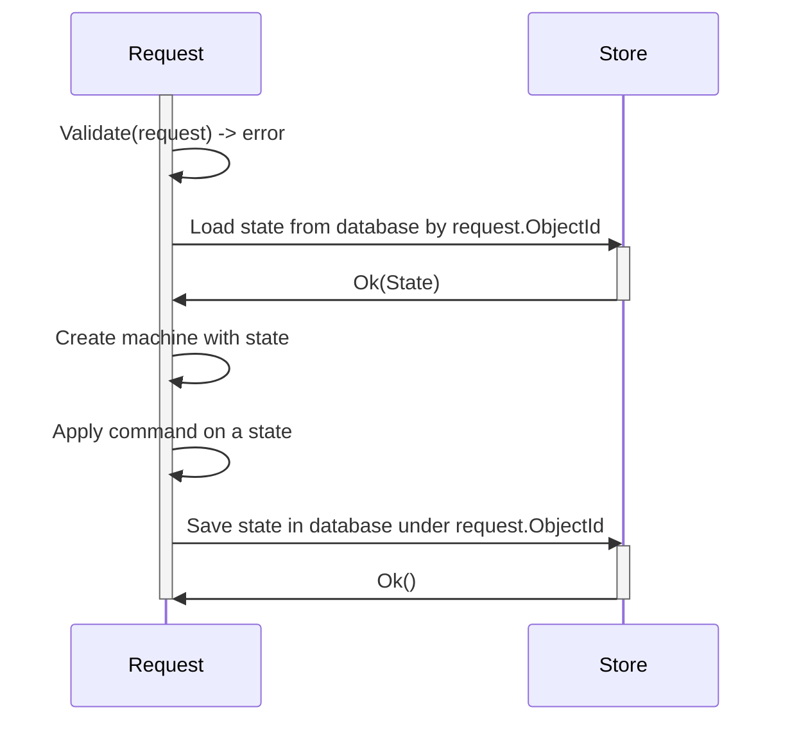

## Persisting state in database

TODO complete description!

At this point of time, we have implemented and tested Order Service state machine.

Next thing that we need to address in our road to the production is to persist state in database.

MkUnion aims to support you in this task, by providing you `x/storage/schemaless` package that will take care of:

- mapping  golang structs to database representation and back from database to struct.
- leveraging optimistic concurrency control to resolve conflicts
- providing you with simple API to work with database
- and more

Below is test case that demonstrate complete example of initializing database,
building an state using `NewMachine` , and saving and loading state from database.

```go title="example/state/machine_database_test.go"
--8<-- "example/state/machine_database_test.go:16:46"
```



Example implementation of such sequence diagram:

```go
func Handle(rq Request, response Resopnse) {
	ctx := rq.Context()
	
	// extract objectId and command from request + do some validation
    id := rq.ObjectId
	command := rq.Command
	
    // Load state from store
    state, err := store.Find(ctx, id)
	if err != nil { /*handle error*/ }

    machine := NewSimpleMachineWithState(Transition, state)
    newState, err := machine.Apply(cmd, state)
    if err != nil { /*handle error*/ }
	
    err := store.Save(ctx, newState)
    if err != nil { /*handle error*/ }
	
	// serialize response
	response.Write(newState)
}
```

## Error as state. Self-healing systems.
In request-response situation, handing errors is easy, but what if in some long-lived process something goes wrong?
How to handle errors in such situation? Without making what we learn about state machines useless or hard to use?

One solution is to treat errors as state.
In such case, our state machines will never return error, but instead will return new state, that will represent error.

When we introduce explicit command responsible for correcting RecoverableError, we can create self-healing systems.
Thanks to that, even in situation when errors are unknown, we can retroactivly introduce self-healing logic that correct states.

Because there is always there is only one error state, it makes such state machines easy to reason about.

```go
//go:generate mkunion -name State
type (
    // ...
    RecoverableError struct {
        ErrCode int
        PrevState State
        RetryCount int
    }
)

//go:generate mkunion -name Command
type (
    // ...
    CorrectStateCMD struct {}
)
```

Now, we have to implement recoverable logic in our state machine.
We show example above how to do it in `Transition` function.

Here is example implementation of such transition function:

```go
func Transition(cmd Command, state State) (State, error) {
return MustMatchCommandR2(
    cmd,
    /* ... */
    func(cmd *CorrectStateCMD) (State, error) {
        switch state := state.(type) {
        case *RecoverableError:
            state.RetryCount = state.RetryCount + 1
			
            // here we can do some self-healing logic
            if state.ErrCode == DuplicateServiceUnavailable {
                newState, err := Transition(&MarkAsDuplicateCMD{}, state.PrevState)
                 if err != nil {
                    // we failed to correct error, so we return error state 
                     return &RecoverableError{
                        ErrCode: err,
                        PrevState: state.PrevState,
                        RetryCount: state.RetryCount,
                    }, nil
                }
				
                 // we manage to fix state, so we return new state
                 return newState, nil
             } else {
                 // log information that we have new code, that we don't know how to handle
             }
			
            // try to correct error in next iteration
            return state, nil
        }
    }
}
```

Now, to correct states we have to select from database all states that are in error state.
It can be use in many ways, example below use a abstraction called `TaskQueue` that is responsible for running tasks in background.

This abstraction guaranties that all records (historical and new ones) will be processed.
You can think about it, as a queue that is populated by records from database, that meet SQL query criteria.

You can use CRON job and pull database.

```go
//go:generate mms deployyml -type=TaskQueue -name=CorrectMSPErrors -autoscale=1,10 -memory=128Mi -cpu=100m -timeout=10s -schedule="0 0 * * *"
func main()
    sql := "SELECT * FROM ObjectState WHERE RecoverableError.RetryCount < 3"
    store := datalayer.DefaultStore()
    queue := TaskQueueFrom("correct-msp-errors", sql, store)
    queue.OnTask(func (ctx context.Context, task Task) error {
        state := task.State()
        cmd := &CorrectStateCMD{}
        machine := NewSimpleMachineWithState(Transition, state)
        newState, err := machine.Apply(cmd, state)
        if err != nil {
            return err
        }
        return task.Save(ctx, newState)
    })
    err := queue.Run(ctx)
    if err != nil {
        log.Panic(err)
    }
}
```


## State machines and command queues and workflows
What if command would initiate state "to process" and save it in db
What if task queue would take such state and process it
Woudn't this be something like command queue?

When to make a list of background processes that transition such states?

### processors per state
It's like micromanage TaskQueue, where each state has it's own state, and it knows what command to apply to given state
This could be good starting point, when there is not a lot of good tooling

### processor for state machine
With good tooling, transition of states can be declared in one place,
and deployment to task queue could be done automatically.

Note, that only some of the transitions needs to happen in background, other can be done in request-response manner.

### processor for state machine with workflow
State machine could be generalized to workflow.
We can think about it as set of generic Command and State (like a turing machine).

States like Pending, Completed, Failed
Commands like Process, Retry, Cancel

And workflow DSL with commands like: Invoke, Choose, Assign
Where function is some ID string, and functions needs to be either
pulled from registry, or called remotely (InvokeRemote).
some operations would require callback (InvokeAndAwait)

Then background processor would be responsible for executing such workflow (using task queue)
Program would be responsible for defining workflow, and registering functions.

Such programs could be also optimised for deployment,
if some function would be better to run on same machine that do RPC call
like function doing RPC call to database, and caching result in memory or in cache cluster dedicated to specific BFF


