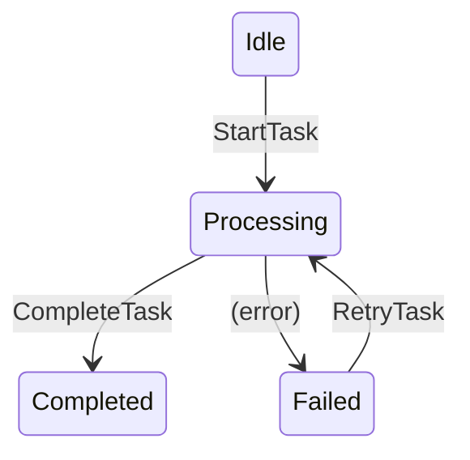

# x/machine - Type-Safe State Machine Framework

The `x/machine` package provides a powerful, type-safe framework for building state machines in Go. It leverages mkunion's union types and pattern matching to create state machines that are both expressive and verifiable, with built-in testing utilities and self-documentation features.

## Overview

The machine package offers:
- **Type-safe state transitions** - Compile-time guarantees for valid state/command combinations
- **Dependency injection** - Clean separation of business logic and external dependencies
- **Comprehensive testing** - Declarative test cases with fuzzy testing support
- **Self-documentation** - Automatic generation of state diagrams from tests
- **Error as state** - Model errors as explicit states for better error handling
- **Pure functions** - Transition functions are pure for predictability and testability

## Core Concepts

### State Machines with Union Types

States and commands are modeled as union types:

```go
//go:tag mkunion:"State"
type (
    Idle struct{}
    Processing struct {
        TaskID string
        StartedAt time.Time
    }
    Completed struct {
        TaskID string
        Result string
    }
    Failed struct {
        TaskID string
        Error  string
        Retries int
    }
)

//go:tag mkunion:"Command"
type (
    StartTask struct {
        TaskID string
    }
    CompleteTask struct {
        Result string
    }
    RetryTask struct{}
)
```

### The Machine Type

The `Machine[D, C, S]` type has three generic parameters:
- `D` - Dependencies: External services and configuration
- `C` - Command: Union type of all possible commands
- `S` - State: Union type of all possible states

```go
type Machine[D, C, S any] struct {
    // ... internal fields
}

// Create a new machine
machine := machine.NewMachine(deps, transitionFunc, initialState)
```

### Transition Functions

The heart of a state machine is its transition function:

```go
func Transition[D, C, S any](
    ctx context.Context,
    deps D,
    cmd C,
    state S,
) (S, error)
```

## Getting Started

### Basic State Machine

```go
// Define dependencies
type Dependencies struct {
    Logger *log.Logger
    DB     *sql.DB
}

// Define transition function
func Transition(ctx context.Context, deps Dependencies, cmd Command, state State) (State, error) {
    return MatchCommandR2(cmd,
        func(c *StartTask) (State, error) {
            // Validate we're in the right state
            return MatchStateR2(state,
                func(s *Idle) (State, error) {
                    deps.Logger.Printf("Starting task %s", c.TaskID)
                    return &Processing{
                        TaskID:    c.TaskID,
                        StartedAt: time.Now(),
                    }, nil
                },
                func(s *Processing) (State, error) {
                    return nil, fmt.Errorf("already processing task %s", s.TaskID)
                },
                func(s *Completed) (State, error) {
                    return nil, fmt.Errorf("task already completed")
                },
                func(s *Failed) (State, error) {
                    return nil, fmt.Errorf("cannot start failed task")
                },
            )
        },
        func(c *CompleteTask) (State, error) {
            // Only valid from Processing state
            return MatchStateR2(state,
                func(s *Processing) (State, error) {
                    return &Completed{
                        TaskID: s.TaskID,
                        Result: c.Result,
                    }, nil
                },
                func(other State) (State, error) {
                    return nil, fmt.Errorf("cannot complete task from current state")
                },
            )
        },
        func(c *RetryTask) (State, error) {
            // Only retry from Failed state
            return MatchStateR2(state,
                func(s *Failed) (State, error) {
                    if s.Retries >= 3 {
                        return nil, fmt.Errorf("max retries exceeded")
                    }
                    return &Processing{
                        TaskID:    s.TaskID,
                        StartedAt: time.Now(),
                    }, nil
                },
                func(other State) (State, error) {
                    return nil, fmt.Errorf("can only retry failed tasks")
                },
            )
        },
    )
}

// Create and use the machine
deps := Dependencies{
    Logger: log.New(os.Stdout, "[TASK] ", log.LstdFlags),
    DB:     db,
}

m := machine.NewMachine(deps, Transition, &Idle{})

// Send commands
err := m.Send(ctx, &StartTask{TaskID: "task-123"})
if err != nil {
    log.Fatal(err)
}

// Check current state
currentState := m.CurrentState()
fmt.Printf("Current state: %#v\n", currentState)
```

### Simple Machines (No Dependencies)

For simpler state machines without external dependencies:

```go
func SimpleTransition(cmd Command, state State) (State, error) {
    // Transition logic without dependencies
}

m := machine.NewSimpleMachine(SimpleTransition, &Idle{})
```

## Testing State Machines

### Declarative Test Suite

The machine package provides a powerful testing framework:

```go
func TestTaskMachine(t *testing.T) {
    // Create test suite
    suite := machine.NewTestSuite(func() *machine.Machine[Dependencies, Command, State] {
        deps := Dependencies{
            Logger: log.New(io.Discard, "", 0),
            DB:     testDB,
        }
        return machine.NewMachine(deps, Transition, &Idle{})
    })

    // Define test cases
    suite.Case("successful task completion", func(t *testing.T, m *machine.Machine[Dependencies, Command, State]) {
        m.When(&StartTask{TaskID: "test-1"}).
            Then(func(s State) {
                processing, ok := s.(*Processing)
                assert.True(t, ok)
                assert.Equal(t, "test-1", processing.TaskID)
            }).
            When(&CompleteTask{Result: "success"}).
            Then(func(s State) {
                completed, ok := s.(*Completed)
                assert.True(t, ok)
                assert.Equal(t, "success", completed.Result)
            })
    })

    suite.Case("retry failed task", func(t *testing.T, m *machine.Machine[Dependencies, Command, State]) {
        // Setup failed state
        m.SetState(&Failed{TaskID: "test-2", Error: "network error", Retries: 0})
        
        m.When(&RetryTask{}).
            Then(func(s State) {
                processing, ok := s.(*Processing)
                assert.True(t, ok)
                assert.Equal(t, "test-2", processing.TaskID)
            })
    })

    // Run all test cases
    suite.Run(t)
}
```

### Fuzzy Testing

Automatically explore all possible state/command combinations:

```go
suite.Fuzzy(func(t *testing.T, m *machine.Machine[Dependencies, Command, State]) {
    // The fuzzy tester will:
    // 1. Try all commands from each state
    // 2. Record successful transitions
    // 3. Note error cases
    // 4. Build a complete state transition map
})
```

### Self-Documentation

Generate state diagrams from your tests:

```go
func TestGenerateDiagram(t *testing.T) {
    suite := machine.NewTestSuite(...)
    
    // Run test cases to explore states
    suite.Run(t)
    
    // Generate and save diagram
    suite.SelfDocumentStateDiagram(t, "task_machine_states.go")
    
    // Or assert against existing diagram
    suite.AssertSelfDocumentStateDiagram(t, "task_machine_states.go")
}
```

This generates a mermaid diagram:



## Advanced Patterns

### Error as State

Instead of returning errors, model error states explicitly:

```go
//go:tag mkunion:"State"
type (
    OrderError struct {
        OrderID   string
        Error     string
        Timestamp time.Time
        Retries   int
    }
)

//go:tag mkunion:"Command"
type (
    TryRecover struct {
        Strategy string
    }
)

// In transition function
func(c *ProcessPayment) (State, error) {
    result, err := deps.PaymentAPI.Process(order)
    if err != nil {
        // Return error state instead of error
        return &OrderError{
            OrderID:   order.ID,
            Error:     err.Error(),
            Timestamp: time.Now(),
            Retries:   0,
        }, nil
    }
    return &OrderPaid{...}, nil
}
```

### Dependency Patterns

Structure dependencies for testability:

```go
type Dependencies interface {
    // Core services
    Logger() *log.Logger
    Database() Database
    
    // External APIs
    PaymentProcessor() PaymentAPI
    NotificationService() NotificationAPI
    
    // Configuration
    MaxRetries() int
    Timeout() time.Duration
}

// Test implementation
type TestDependencies struct {
    MockPayment *MockPaymentAPI
    // ... other mocks
}

// Production implementation
type ProdDependencies struct {
    // ... real implementations
}
```

### Hierarchical State Machines

Build complex systems with nested machines:

```go
// Parent machine manages overall workflow
type WorkflowMachine struct {
    OrderMachine    *machine.Machine[Deps, OrderCmd, OrderState]
    PaymentMachine  *machine.Machine[Deps, PaymentCmd, PaymentState]
    ShippingMachine *machine.Machine[Deps, ShippingCmd, ShippingState]
}

// Coordinate between machines
func (w *WorkflowMachine) ProcessOrder(ctx context.Context, order Order) error {
    // Start order processing
    err := w.OrderMachine.Send(ctx, &CreateOrder{Order: order})
    if err != nil {
        return err
    }
    
    // When order is confirmed, process payment
    if w.OrderMachine.CurrentState().(*OrderConfirmed) != nil {
        err = w.PaymentMachine.Send(ctx, &ChargePayment{
            Amount: order.Total,
        })
    }
    
    // Continue with shipping...
}
```

## Best Practices

### 1. Keep Transitions Pure

```go
// Good: Pure transition function
func Transition(ctx context.Context, deps Deps, cmd Command, state State) (State, error) {
    // Only compute new state, no side effects
    return newState, nil
}

// Bad: Side effects in transition
func BadTransition(...) (State, error) {
    // Don't do this!
    database.Save(state) // Side effect
    return newState, nil
}
```

### 2. Use Explicit States

```go
// Good: Explicit states
type (
    WaitingForApproval struct { RequestID string }
    Approved struct { ApprovedBy string; At time.Time }
    Rejected struct { RejectedBy string; Reason string }
)

// Avoid: Generic states
type State struct {
    Status string // "waiting", "approved", "rejected"
    Data   map[string]any
}
```

### 3. Validate State Transitions

```go
// Ensure commands are valid for current state
return MatchStateR2(state,
    func(s *CanTransition) (State, error) {
        // Valid transition
        return &NextState{}, nil
    },
    func(other State) (State, error) {
        // Invalid transition
        return nil, fmt.Errorf("cannot perform action from state %T", other)
    },
)
```

### 4. Test Everything

```go
// Test happy paths
suite.Case("successful flow", ...)

// Test error cases
suite.Case("handle network failure", ...)

// Test edge cases
suite.Case("concurrent commands", ...)

// Use fuzzy testing
suite.Fuzzy(...)
```

## Integration Examples

### With x/storage

Persist state machine state:

```go
type PersistentMachine struct {
    machine *machine.Machine[Deps, Command, State]
    storage storage.Repository[State]
}

func (p *PersistentMachine) Send(ctx context.Context, cmd Command) error {
    // Execute transition
    err := p.machine.Send(ctx, cmd)
    if err != nil {
        return err
    }
    
    // Persist new state
    return p.storage.Save(ctx, storage.Record[State]{
        ID:   p.machine.ID(),
        Data: p.machine.CurrentState(),
    })
}
```

### With x/workflow

Use state machines in workflows:

```go
// Define workflow that uses state machine
workflow := &Flow{
    Name: "order_workflow",
    Body: []Expr{
        &Apply{
            Name: "create_order_machine",
            Args: []Reshaper{
                &GetValue{Path: "order"},
            },
        },
        &Apply{
            Name: "process_order",
            Await: &ApplyAwait{Timeout: 300},
        },
    },
}
```

## Performance Considerations

1. **State Size**: Keep state data minimal
2. **Transition Speed**: Transitions should be fast (< 1ms)
3. **Memory Usage**: Machines are lightweight, can create many
4. **Concurrency**: Machines are not thread-safe by default

## Debugging

### Enable Logging

```go
deps := Dependencies{
    Logger: log.New(os.Stdout, "[MACHINE] ", log.LstdFlags | log.Lshortfile),
}

// In transitions
deps.Logger.Printf("Transitioning from %T to %T", state, newState)
```

### Inspect State History

```go
// Track state history
type HistoryMachine struct {
    *machine.Machine[D, C, S]
    history []S
}

func (h *HistoryMachine) Send(ctx context.Context, cmd C) error {
    err := h.Machine.Send(ctx, cmd)
    if err == nil {
        h.history = append(h.history, h.CurrentState())
    }
    return err
}
```

## Common Patterns

### Timeout Handling

```go
type TimeoutState struct {
    OriginalState State
    StartedAt     time.Time
    TimeoutAt     time.Time
}

// Check timeouts in transition
if time.Now().After(s.TimeoutAt) {
    return &TimedOut{
        OriginalState: s.OriginalState,
    }, nil
}
```

### Compensating Actions

```go
// Track actions for rollback
type CompensatableState struct {
    Actions []CompensatingAction
}

type CompensatingAction struct {
    Do       func() error
    Undo     func() error
    Executed bool
}
```

## Troubleshooting

Common issues and solutions:

1. **Invalid transitions**: Check state/command matching logic
2. **Missing states in tests**: Use fuzzy testing to find gaps
3. **Diagram generation fails**: Ensure test cases cover all transitions
4. **Performance issues**: Profile transition functions, reduce state size

## Further Reading

- [State Machine Examples](../examples/state_machine.md)
- [State Machine Best Practices](../examples/state_machine_best_practices.md)
- [Testing Guide](../development/testing.md)
- [Workflow Integration](./workflow.md)