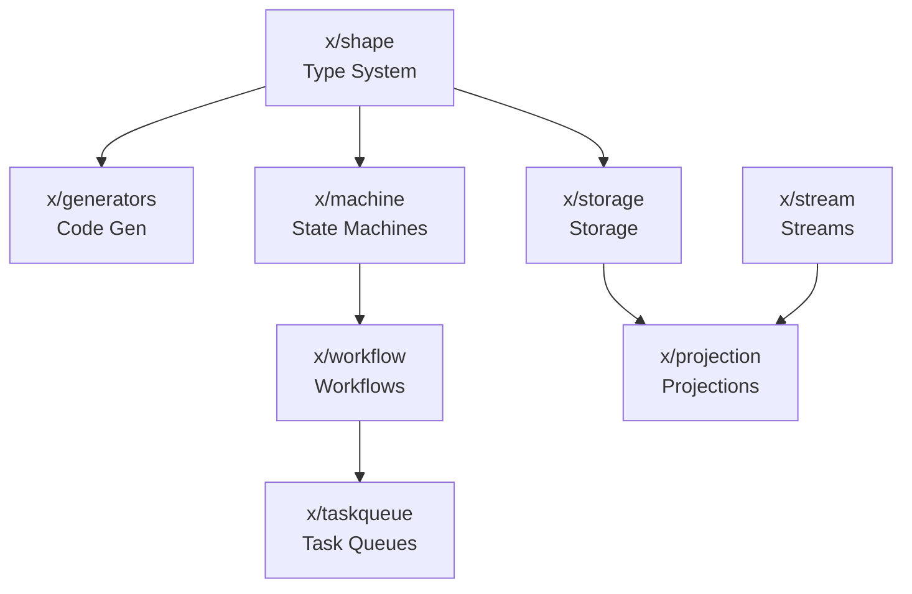

# Extended Packages (x/)

The `x/` directory contains experimental and extended packages that enhance mkunion's core functionality. These packages provide advanced features for building robust, type-safe applications with Go.

> **Note**: Packages in the `x/` directory are considered **experimental**. While they are actively maintained and used in production by some projects, their APIs may change between minor versions. Always check the changelog when upgrading.

## Package Categories

### Core Infrastructure

#### [**x/shape**](./shape.md) - Type Introspection and Representation
The foundation of mkunion's type system, providing runtime type information and shape inference for Go types. Essential for serialization, code generation, and type-safe operations.

#### [**x/generators**](./generators.md) - Code Generation Framework
Powers mkunion's code generation capabilities, creating union types, pattern matching, serialization code, and TypeScript definitions from Go source code.

### State Management and Workflows

#### [**x/machine**](./machine.md) - State Machine Framework
A type-safe state machine implementation with exhaustive pattern matching, self-documenting capabilities, and comprehensive testing utilities.

#### [**x/workflow**](./workflow.md) - Workflow Engine
Built on top of the state machine framework, provides durable workflow execution with persistence, recovery, and distributed execution capabilities.

### Data Processing and Storage

#### [**x/storage**](./storage.md) - Schemaless Storage Abstractions
A flexible storage layer supporting union types, predicate queries, and multiple backends (in-memory, DynamoDB, etc.) with a consistent API.

#### [**x/projection**](./projection.md) - Event Projection System
Implements event sourcing patterns with support for windowing, aggregations, and state recovery from event streams.

### Utilities and Extensions

#### **x/stream** - Stream Processing
Type-safe stream abstractions for building data pipelines with support for Kafka and in-memory implementations.

#### **x/taskqueue** - Task Queue Implementations
Provides task queue abstractions with implementations for AWS SQS and in-memory queues, suitable for background job processing.

#### **x/schema** - Schema Utilities
Tools for working with type schemas, including location paths for navigating complex data structures and schema transformations.

#### **x/search** - Search and Indexing
Text search capabilities with tokenization and indexing support for building search functionality into applications.

## Package Relationships



## Getting Started

1. **For Type-Safe Union Types**: Start with the [Getting Started Guide](../getting_started.md) to understand mkunion's core features
2. **For State Machines**: See [x/machine](./machine.md) for building state-driven applications
3. **For Storage**: Check [x/storage](./storage.md) for flexible data persistence
4. **For Workflows**: Explore [x/workflow](./workflow.md) for long-running processes

## Common Use Cases

### Building a State-Driven Application
```go
// Define states and commands as union types
//go:tag mkunion:"State"
type (
    Idle struct{}
    Processing struct{ TaskID string }
    Completed struct{ Result string }
)

// Use x/machine for state management
machine := machine.NewMachine(deps, transition, &Idle{})
```

### Storing Union Types
```go
// Use x/storage for persisting union types
repo := schemaless.NewRepository[MyUnionType](
    storage.NewInMemoryStorage(),
)
items, _ := repo.FindAll(ctx, predicate.Eq("status", "active"))
```

### Processing Event Streams
```go
// Use x/projection for event processing
projection := projection.New(
    stream.NewKafkaStream(config),
    handler.NewAggregator[Event, State](),
)
```

## API Stability

| Package | Stability | Notes |
|---------|-----------|-------|
| x/shape | Beta | Core API stable, minor additions expected |
| x/generators | Beta | Command-line interface stable |
| x/machine | Beta | API stable, testing utilities evolving |
| x/workflow | Alpha | API may change based on feedback |
| x/storage | Beta | Core interfaces stable |
| x/projection | Alpha | Windowing API under development |
| x/stream | Alpha | Interface stabilizing |
| x/taskqueue | Beta | Basic functionality stable |

## Best Practices

1. **Version Pinning**: Pin specific versions when using x/ packages in production
2. **Testing**: Leverage the comprehensive testing utilities, especially for state machines
3. **Documentation**: Use self-documenting features (e.g., state diagrams) for complex logic
4. **Error Handling**: All packages follow Go's error handling conventions
5. **Context Usage**: Most operations accept `context.Context` for cancellation and timeouts

## Migration and Compatibility

When upgrading between versions:

1. Check the [CHANGELOG](https://github.com/widmogrod/mkunion/blob/main/CHANGELOG.md) for breaking changes
2. Run `mkunion watch ./...` to regenerate code after updates
3. Update import paths if packages are reorganized
4. Test thoroughly, especially for x/ packages marked as Alpha

## Contributing

The x/ packages welcome contributions! See the [main contributing guide](https://github.com/widmogrod/mkunion/blob/main/CONTRIBUTING.md) for details. When contributing to x/ packages:

1. Maintain backward compatibility when possible
2. Add comprehensive tests for new features
3. Update documentation alongside code changes
4. Consider the experimental nature when designing APIs