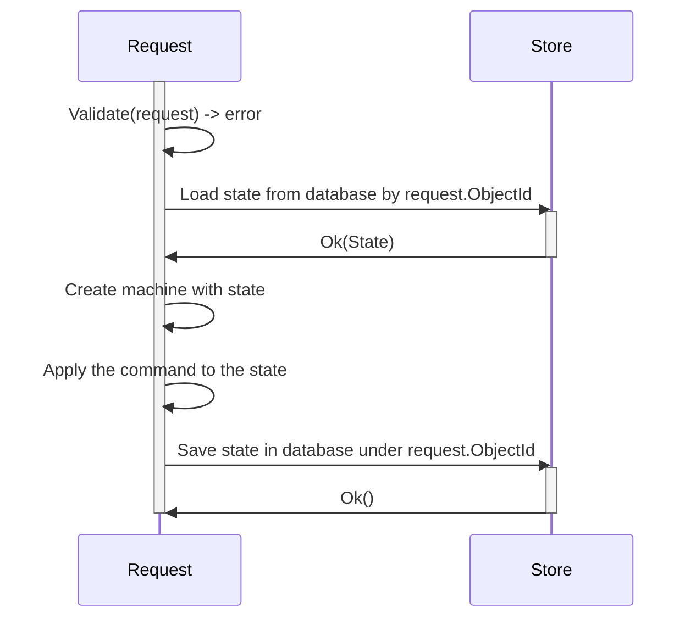

# mkunion and state machines
The package models state machines as a union of **states**, and transition functions as a union of **commands**.
The package provides an inference method to visualize state machines as a mermaid diagram.

## TODO
- [ ] Explain field management
- [ ] Dependency injection
- [ ] Demonstrate process orchestration
- [ ] Demonstrate states managing states
- [ ] Visualize error state
- [ ] Describe why not to start with a state diagram first: TDD, fuzzing, self-documentation, and context coherence vs. context switching
- [ ] Describe storage with version use case as optimistic locking

## Example
Look into the [machine_test.go](../../example/state/machine_test.go) directory for a complete example.

The example implements such a state machine:
```mermaid
stateDiagram
	[*] --> "*state.Candidate": "*state.CreateCandidateCMD"
	"*state.Candidate" --> "*state.Unique": "*state.MarkAsUniqueCMD"
	"*state.Candidate" --> "*state.Canonical": "*state.MarkAsCanonicalCMD"
	"*state.Candidate" --> "*state.Duplicate": "*state.MarkAsDuplicateCMD"
```

Below is a code sample that demonstrates how to implement such a state machine in Go.
The code shows how to use `mkunion` to generate a union of commands and states.

```go
//go:generate mkunion -name State
type (
    Candidate struct {} // Corrected typo: Candiate -> Candidate
    Duplicate struct {}
    Canonical struct {}
    Unique struct {}
)

//go:generate mkunion -name Command
type (
    CreateCandidateCMD struct {}
    MarkAsDuplicateCMD struct {}
    MarkAsCanonicalCMD struct {}
    MarkAsUniqueCMD struct {}
)

var (
    ErrCannotChangeDuplicateToCanonical = errors.New("cannot change duplicate to canonical")
)

func Transition(cmd Command, state State) (State, error) {
    return MustMatchCommandR2(
        cmd,
        func(cmd *CreateCandidateCMD) (State, error) {/* ... */},
        func(cmd *MarkAsDuplicateCMD) (State, error) {
            if _, ok := state.(*Canonical); ok { // Check type assertion result
                return nil, ErrCannotChangeDuplicateToCanonical
            }

            return &Duplicate{}, nil
        }, 
        func(cmd *MarkAsCanonicalCMD) (State, error) {/* .. */}, 
        func(cmd *MarkAsUniqueCMD) (State, error) {/* ... */},
    )
}
```

## Testing state machines & self documenting
The library provides a way to test state machines and generate a mermaid diagram from tests.
The diagram you see above is generated from the following test.

```go
func TestSuite(t *testing.T) {
    suite := machine.NewTestSuite(NewMachine)
    suite.Case(
        "happy path of transitions",
        func(c *machine.Case[Command, State]) {
            c.GivenCommand(&CreateCandidateCMD{ID: "123"}).
                ThenState(&Candidate{ID: "123"}).
                ThenNext("can mark as canonical", func(c *machine.Case[Command, State]) {
                    c.GivenCommand(&MarkAsCanonicalCMD{}).
                        ThenState(&Canonical{ID: "123"})
                }).
                ThenNext("can mark as duplicate", func(c *machine.Case[Command, State]) {
                    c.GivenCommand(&MarkAsDuplicateCMD{CanonicalID: "456"}).
                        ThenState(&Duplicate{ID: "123", CanonicalID: "456"})
                }).
                ThenNext("can mark as unique", func(c *machine.Case[Command, State]) {
                    c.GivenCommand(&MarkAsUniqueCMD{}).
                        ThenState(&Unique{ID: "123"})
                })
        },
    )
    suite.Run(t)
    suite.Fuzzy(t)

    // this line will generate a mermaid diagram, for TDD cycles use line below
    // if true || suite.AssertSelfDocumentStateDiagram(t, "simple_machine_test.go")
    if suite.AssertSelfDocumentStateDiagram(t, "simple_machine_test.go") {
        suite.SelfDocumentStateDiagram(t, "simple_machine_test.go")
    }
}
```

## Infer state diagram from tests - self documenting
Note in the above example the function `suite.Fuzzy(t)`.
This function explores how the machine will act on transitions between states that are not explicitly defined.
Using fuzzing helps to discover edge cases that can be inspected visually.

`suite.SelfDocumentStateDiagram` will create two diagrams. 
- The first one is a diagram of ONLY successful transitions, which is easier to read (first diagram in this document).
- The second one is a diagram that includes transitions that resulted in an error; such a diagram is much more visually complex, yet also valuable.


```mermaid
stateDiagram
	[*] --> "*state.Candidate": "*state.CreateCandidateCMD"
 %% error=state is not candidate, state: *state.Canonical; invalid cmds 
	"*state.Canonical" --> "*state.Canonical": "❌*state.MarkAsDuplicateCMD"
 %% error=state is not candidate, state: <nil>; invalid cmds 
	[*] --> [*]: "❌*state.MarkAsDuplicateCMD"
 %% error=candidate already created, state: *state.Canonical; invalid cmds 
	"*state.Canonical" --> "*state.Canonical": "❌*state.CreateCandidateCMD"
 %% error=candidate already created, state: *state.Candidate; invalid cmds 
	"*state.Candidate" --> "*state.Candidate": "❌*state.CreateCandidateCMD"
	"*state.Candidate" --> "*state.Unique": "*state.MarkAsUniqueCMD"
 %% error=candidate already created, state: *state.Unique; invalid cmds 
	"*state.Unique" --> "*state.Unique": "❌*state.CreateCandidateCMD"
 %% error=state is not candidate, state: *state.Unique; invalid cmds 
	"*state.Unique" --> "*state.Unique": "❌*state.MarkAsDuplicateCMD"
 %% error=candidate already created, state: *state.Duplicate; invalid cmds 
	"*state.Duplicate" --> "*state.Duplicate": "❌*state.CreateCandidateCMD"
	"*state.Candidate" --> "*state.Canonical": "*state.MarkAsCanonicalCMD"
 %% error=state is not candidate, state: *state.Unique; invalid cmds 
	"*state.Unique" --> "*state.Unique": "❌*state.MarkAsCanonicalCMD"
 %% error=state is not candidate, state: *state.Unique; invalid cmds 
	"*state.Unique" --> "*state.Unique": "❌*state.MarkAsUniqueCMD"
 %% error=state is not candidate, state: *state.Canonical; invalid cmds 
	"*state.Canonical" --> "*state.Canonical": "❌*state.MarkAsUniqueCMD"
 %% error=state is not candidate, state: *state.Canonical; invalid cmds 
	"*state.Canonical" --> "*state.Canonical": "❌*state.MarkAsCanonicalCMD"
 %% error=state is not candidate, state: *state.Duplicate; invalid cmds 
	"*state.Duplicate" --> "*state.Duplicate": "❌*state.MarkAsCanonicalCMD"
 %% error=state is not candidate, state: <nil>; invalid cmds 
	[*] --> [*]: "❌*state.MarkAsUniqueCMD"
 %% error=state is not candidate, state: <nil>; invalid cmds 
	[*] --> [*]: "❌*state.MarkAsCanonicalCMD"
 %% error=state is not candidate, state: *state.Duplicate; invalid cmds 
	"*state.Duplicate" --> "*state.Duplicate": "❌*state.MarkAsDuplicateCMD"
	"*state.Candidate" --> "*state.Duplicate": "*state.MarkAsDuplicateCMD"
 %% error=state is not candidate, state: *state.Duplicate; invalid cmds 
	"*state.Duplicate" --> "*state.Duplicate": "❌*state.MarkAsUniqueCMD"
```


## Persisting state in database



Example implementation of such a sequence diagram:

```go
func Handle(rq Request, response Response) { 
	ctx := rq.Context()
	
	// extract `objectId` and `command` from the request and perform some validation
    id := rq.ObjectId
	command := rq.Command
	
    // Load the state from the store
    state, err := store.Find(ctx, id)
	if err != nil { /*handle error*/ }

    machine := NewSimpleMachineWithState(Transition, state)
    newState, err := machine.Apply(command, state) 
    if err != nil { /*handle error*/ }
	
    err = store.Save(ctx, newState) 
    if err != nil { /*handle error*/ }
	
	// serialize the response
	response.Write(newState)
}
```

## Error as state. Self-healing systems.
In a request-response situation, handling errors is easy, but what if something goes wrong in some long-lived process?
How should errors be handled in such a situation? Without making what we've learned about state machines useless or hard to use?

One solution is to treat errors as state.
In such a case, our state machines will never return an error, but instead will return a new state that will represent an error.

When we introduce an explicit command responsible for correcting `RecoverableError`, we can create self-healing systems.
Thanks to that, even in situations where errors are unknown, we can retroactively introduce self-healing logic that corrects states.

Since there is always only one error state, it makes such state machines easy to reason about.

```go
//go:generate mkunion -name State
type (
    // ...
    RecoverableError struct {
        ErrCode int
        PrevState State
        RetryCount int
    }
)

//go:generate mkunion -name Command
type (
    // ...
    CorrectStateCMD struct {}
)
```

Now, we have to implement the recoverable logic in our state machine.
The example above shows how to do it in the `Transition` function.

Here is an example implementation of such a transition function:

```go
func Transition(cmd Command, state State) (State, error) {
    return MustMatchCommandR2(
        cmd,
        /* ... */
        func(cmd *CorrectStateCMD) (State, error) {
            switch state := state.(type) {
            case *RecoverableError:
                state.RetryCount = state.RetryCount + 1
                
                // here we can do some self-healing logic
                if state.ErrCode == DuplicateServiceUnavailable { // DuplicateServiceUnavailable is a defined error code
                    newState, err := Transition(&MarkAsDuplicateCMD{}, state.PrevState) 
                     if err != nil {
                        // we failed to correct the error, so we return an error state 
                         return &RecoverableError{
                            ErrCode:    0, // Consider setting a more specific error code from 'err'
                            PrevState:  state.PrevState,
                            RetryCount: state.RetryCount,
                        }, nil
                    }
                    
                     // we managed to fix the state, so we return new state
                     return newState, nil
                 } else {
                     // log information that we have a new error code that we don't know how to handle
                 }
                
                // try to correct the error in the next iteration
                return state, nil
            }
            return state, nil // Added default return for the switch
        },
    )
}
```

Now, to correct states, we have to select all states that are in an error state from the database.
It can be used in many ways; the example below uses an abstraction called `TaskQueue` that is responsible for running tasks in the background.

This abstraction guarantees that all records (historical and new ones) will be processed.
You can think of it as a queue that is populated by records from the database that meet SQL query criteria.

You can use a CRON job and poll the database.

```go
//go:generate mms deployyml -type=TaskQueue -name=CorrectMSPErrors -autoscale=1,10 -memory=128Mi -cpu=100m -timeout=10s -schedule="0 0 * * *"
func main()
    sql := "SELECT * FROM ObjectState WHERE RecoverableError.RetryCount < 3" // Assuming ObjectState is the table
    store := datalayer.DefaultStore() // Assuming datalayer.DefaultStore() is available
    queue := TaskQueueFrom("correct-msp-errors", sql, store) // Assuming TaskQueueFrom is available
    queue.OnTask(func (ctx context.Context, task Task) error { // Assuming Task type is defined
        state := task.State()
        cmd := &CorrectStateCMD{}
        machine := NewSimpleMachineWithState(Transition, state)
        newState, err := machine.Apply(cmd, state) // machine.Apply might need context
        if err != nil {
            return err
        }
        return task.Save(ctx, newState) // Assuming task.Save is available
    })
    err := queue.Run(ctx) // Assuming ctx is defined
    if err != nil {
        log.Panic(err)
    }
}
```


## State machines and command queues and workflows
What if a command would initiate a state "to process" and save it in the database?
What if a task queue would take such a state and process it?
Wouldn't this be something like a command queue?

Under what conditions should background processes be used to transition these states?

### Processors per state
It's like micromanaging the TaskQueue, where each state has its own state and knows what command to apply to a given state.
This could be a good starting point when there isn't a lot of good tooling.

### Processor for state machine
With good tooling, the transition of states can be declared in one place, 
and deployment to the task queue could be done automatically.

Note that only some of the transitions need to happen in the background; others can be done in a request-response manner.

### Processor for state machine with workflow
A state machine could be generalized to a workflow.
We can think about it as a set of generic Commands and States (like a Turing machine).

States like `Pending`, `Completed`, `Failed`.
Commands like `Process`, `Retry`, `Cancel`.

And a workflow DSL with commands like: `Invoke`, `Choose`, `Assign`.
Where a function is some ID string, and functions need to be either 
pulled from a registry or called remotely (`InvokeRemote`).
Some operations would require a callback (`InvokeAndAwait`).

Then a background processor would be responsible for executing such a workflow (using a task queue).
The program would be responsible for defining the workflow and registering functions.

Such programs could also be optimized for deployment, 
if some function would be better to run on the same machine that makes an RPC call,
like a function making an RPC call to a database and caching the result in memory or in a cache cluster dedicated to a specific BFF.


