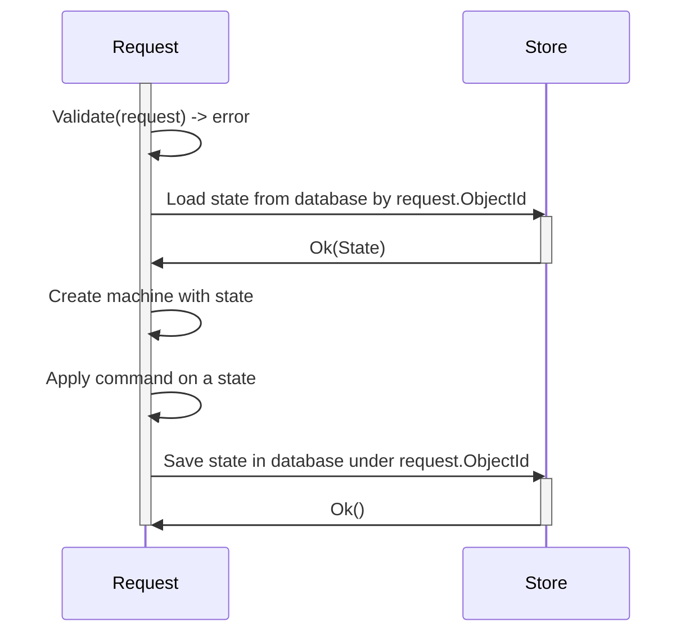

# mkunion and state machines
Package models state machines as a union of **states**, and transition functions as a union of **commands**.
Package provides an inferring method to visualize state machines as a mermaid diagram.

## Example
Look into [simple_machine_test.go](../../example/state/simple_machine_test.go) directory for a complete example.

Example implements such state machine:
```mermaid
stateDiagram
	[*] --> "*state.Candidate": "*state.CreateCandidateCMD"
	"*state.Candidate" --> "*state.Unique": "*state.MarkAsUniqueCMD"
	"*state.Candidate" --> "*state.Canonical": "*state.MarkAsCanonicalCMD"
	"*state.Candidate" --> "*state.Duplicate": "*state.MarkAsDuplicateCMD"
```

Below is a code sample that demonstrate how to implement such state machine in golang.
Code shows how to use `mkunion` to generate union of commands and states

```go
//go:generate mkunion -name State
type (
    Candiate struct {}
    Duplicate struct {}
    Canonical struct {}
    Unique struct {}
)

//go:generate mkunion -name Command
type (
    CreateCandidateCMD struct {}
    MarkAsDuplicateCMD struct {}
    MarkAsCanonicalCMD struct {}
    MarkAsUniqueCMD struct {}
)

var (
    ErrCannotChangeDuplicateToCanonical = errors.New("cannot change duplicate to canonical")
)

func Transition(cmd Command, state State) (State, error) {
    return MustMatchCommandR2(
        cmd,
        func (cmd *CreateCandidateCMD) (State, error) {/* ... */},
        func (cmd *MarkAsDuplicateCMD) (State, error) {
            if state.(*Canonical) {
                return nil, ErrCannotChangeDuplicateToCanonical
            }

            return &Duplicate{}, nil
        }, 
        func (cmd *MarkAsCanonicalCMD) (State, error) {/* .. */}, 
        func (cmd *MarkAsUniqueCMD) (State, error) {/* ... */},
    )
}
```

## Testing state machines & self documenting
Library provides a way to test state machines and generate a mermaid diagram from tests.
Above diagram that you see is generated from the following test.

```go
func TestSuite(t *testing.T) {
    suite := machine.NewTestSuite(NewMachine)
    suite.Case(
        "happy path of transitions",
        func(c *machine.Case[Command, State]) {
            c.GivenCommand(&CreateCandidateCMD{ID: "123"}).
                ThenState(&Candidate{ID: "123"}).
                ThenNext("can mark as canonical", func(c *machine.Case[Command, State]) {
                    c.GivenCommand(&MarkAsCanonicalCMD{}).
                        ThenState(&Canonical{ID: "123"})
                }).
                ThenNext("can mark as duplicate", func(c *machine.Case[Command, State]) {
                    c.GivenCommand(&MarkAsDuplicateCMD{CanonicalID: "456"}).
                        ThenState(&Duplicate{ID: "123", CanonicalID: "456"})
                }).
                ThenNext("can mark as unique", func(c *machine.Case[Command, State]) {
                    c.GivenCommand(&MarkAsUniqueCMD{}).
                        ThenState(&Unique{ID: "123"})
                })
        },
    )
    suite.Run(t)
    suite.Fuzzy(t)

    // this line will generate a mermaid diagram, for TDD cycles use line below
    // if true || suite.AssertSelfDocumentStateDiagram(t, "simple_machine_test.go")
    if suite.AssertSelfDocumentStateDiagram(t, "simple_machine_test.go") {
        suite.SelfDocumentStateDiagram(t, "simple_machine_test.go")
    }
}
```

## Infer stat diagram from tests - self documenting
Note in above example function `suite.Fuzzy(t)`.
This function explore how machine will act on transition between states, that are not explicitly defined.
Using Fuzzy help to discover edge cases, that can be inspected visually.

`suite.SelfDocumentStateDiagram` will create two diagrams. 
- First one is a diagram of ONLY successful transitions, that are easier to read (first diagram in this document).
- Second one is a diagram that includes transition that resulted in an error, such diagram is much more visually complex, yet also valuable.


```mermaid
stateDiagram
	[*] --> "*state.Candidate": "*state.CreateCandidateCMD"
 %% error=state is not candidate, state: *state.Canonical; invalid cmds 
	"*state.Canonical" --> "*state.Canonical": "❌*state.MarkAsDuplicateCMD"
 %% error=state is not candidate, state: <nil>; invalid cmds 
	[*] --> [*]: "❌*state.MarkAsDuplicateCMD"
 %% error=candidate already created, state: *state.Canonical; invalid cmds 
	"*state.Canonical" --> "*state.Canonical": "❌*state.CreateCandidateCMD"
 %% error=candidate already created, state: *state.Candidate; invalid cmds 
	"*state.Candidate" --> "*state.Candidate": "❌*state.CreateCandidateCMD"
	"*state.Candidate" --> "*state.Unique": "*state.MarkAsUniqueCMD"
 %% error=candidate already created, state: *state.Unique; invalid cmds 
	"*state.Unique" --> "*state.Unique": "❌*state.CreateCandidateCMD"
 %% error=state is not candidate, state: *state.Unique; invalid cmds 
	"*state.Unique" --> "*state.Unique": "❌*state.MarkAsDuplicateCMD"
 %% error=candidate already created, state: *state.Duplicate; invalid cmds 
	"*state.Duplicate" --> "*state.Duplicate": "❌*state.CreateCandidateCMD"
	"*state.Candidate" --> "*state.Canonical": "*state.MarkAsCanonicalCMD"
 %% error=state is not candidate, state: *state.Unique; invalid cmds 
	"*state.Unique" --> "*state.Unique": "❌*state.MarkAsCanonicalCMD"
 %% error=state is not candidate, state: *state.Unique; invalid cmds 
	"*state.Unique" --> "*state.Unique": "❌*state.MarkAsUniqueCMD"
 %% error=state is not candidate, state: *state.Canonical; invalid cmds 
	"*state.Canonical" --> "*state.Canonical": "❌*state.MarkAsUniqueCMD"
 %% error=state is not candidate, state: *state.Canonical; invalid cmds 
	"*state.Canonical" --> "*state.Canonical": "❌*state.MarkAsCanonicalCMD"
 %% error=state is not candidate, state: *state.Duplicate; invalid cmds 
	"*state.Duplicate" --> "*state.Duplicate": "❌*state.MarkAsCanonicalCMD"
 %% error=state is not candidate, state: <nil>; invalid cmds 
	[*] --> [*]: "❌*state.MarkAsUniqueCMD"
 %% error=state is not candidate, state: <nil>; invalid cmds 
	[*] --> [*]: "❌*state.MarkAsCanonicalCMD"
 %% error=state is not candidate, state: *state.Duplicate; invalid cmds 
	"*state.Duplicate" --> "*state.Duplicate": "❌*state.MarkAsDuplicateCMD"
	"*state.Candidate" --> "*state.Duplicate": "*state.MarkAsDuplicateCMD"
 %% error=state is not candidate, state: *state.Duplicate; invalid cmds 
	"*state.Duplicate" --> "*state.Duplicate": "❌*state.MarkAsUniqueCMD"
```


## Persisting state in database



Example implementation of such sequence diagram:

```go
func Handle(rq Request, response Resopnse) {
	ctx := rq.Context()
	
	// extract objectId and command from request + do some validation
    id := rq.ObjectId
	command := rq.Command
	
    // Load state from store
    state, err := store.Find(ctx, id)
	if err != nil { /*handle error*/ }

    machine := NewSimpleMachineWithState(Transition, state)
    newState, err := machine.Apply(cmd, state)
    if err != nil { /*handle error*/ }
	
    err := store.Save(ctx, newState)
    if err != nil { /*handle error*/ }
	
	// serialize response
	response.Write(newState)
}
```

## Error as state. Self-healing systems.
In request-response situation, handing errors is easy, but what if in some long-lived process something goes wrong?
How to handle errors in such situation? Without making what we learn about state machines useless or hard to use?

One solution is to treat errors as state.
In such case, our state machines will never return error, but instead will return new state, that will represent error.

When we introduce explicit command responsible for correcting RecoverableError, we can create self-healing systems.
Thanks to that, even in situation when errors are unknown, we can retroactivly introduce self-healing logic that correct states.

Because there is always there is only one error state, it makes such state machines easy to reason about.

```go
//go:generate mkunion -name State
type (
    // ...
    RecoverableError struct {
        ErrCode int
        PrevState State
        RetryCount int
    }
)

//go:generate mkunion -name Command
type (
    // ...
    CorrectStateCMD struct {}
)
```

Now, we have to implement recoverable logic in our state machine.
We show example above how to do it in `Transition` function.

Here is example implementation of such transition function:

```go
func Transition(cmd Command, state State) (State, error) {
return MustMatchCommandR2(
    cmd,
    /* ... */
    func(cmd *CorrectStateCMD) (State, error) {
        switch state := state.(type) {
        case *RecoverableError:
            state.RetryCount = state.RetryCount + 1
			
            // here we can do some self-healing logic
            if state.ErrCode == DuplicateServiceUnavailable {
                newState, err := Transition(&MarkAsDuplicateCMD{}, state.PrevState)
                 if err != nil {
                    // we failed to correct error, so we return error state 
                     return &RecoverableError{
                        ErrCode: err,
                        PrevState: state.PrevState,
                        RetryCount: state.RetryCount,
                    }, nil
                }
				
                 // we manage to fix state, so we return new state
                 return newState, nil
             } else {
                 // log information that we have new code, that we don't know how to handle
             }
			
            // try to correct error in next iteration
            return state, nil
        }
    }
}
```

Now, to correct states we have to select from database all states that are in error state.
It can be use in many ways, example below use a abstraction called `TaskQueue` that is responsible for running tasks in background.

This abstraction guaranties that all records (historical and new ones) will be processed.
You can think about it, as a queue that is populated by records from database, that meet SQL query criteria.

You can use CRON job and pull database.

```go
//go:generate mms deployyml -type=TaskQueue -name=CorrectMSPErrors -autoscale=1,10 -memory=128Mi -cpu=100m -timeout=10s -schedule="0 0 * * *"
func main()
    sql := "SELECT * FROM ObjectState WHERE RecoverableError.RetryCount < 3"
    store := datalayer.DefaultStore()
    queue := TaskQueueFrom("correct-msp-errors", sql, store)
    queue.OnTask(func (ctx context.Context, task Task) error {
        state := task.State()
        cmd := &CorrectStateCMD{}
        machine := NewSimpleMachineWithState(Transition, state)
        newState, err := machine.Apply(cmd, state)
        if err != nil {
            return err
        }
        return task.Save(ctx, newState)
    })
    err := queue.Run(ctx)
    if err != nil {
        log.Panic(err)
    }
}
```